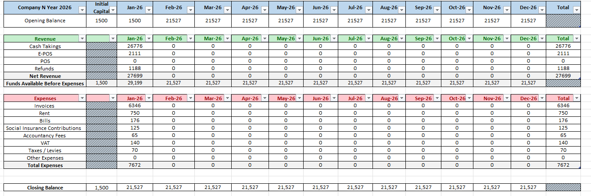
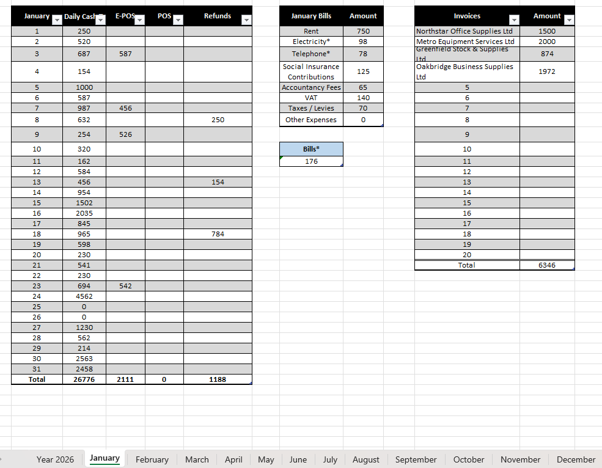

# Excel Financial Reporting

## Project Overview
This project is an automated Excel financial reporting workbook designed to consolidate financial information into one place.

The original problem was that financial information was spread across multiple screens, pages and files. 
This made it harder to see the overall financial position of the company and increased the amount of manual checking needed.

I created a workbook that organises monthly financial data and automatically feeds the relevant figures into an annual report. 
This reduces the need to move between multiple files and makes the information easier to review.

## What the Report Shows

The workbook provides a clear view of:
- opening and closing balances
- monthly revenue
- refunds
- business expenses
- invoices and bills
- total annual figures

The annual report brings the key figures together so the company's available funds, revenue and expenses can be reviewed from one place.

## Screenshots

### Yearly Financial Summary

### Monthly Data Input

## Data

All company names, supplier names and financial figures used in this portfolio version are fictional/synthetic.
